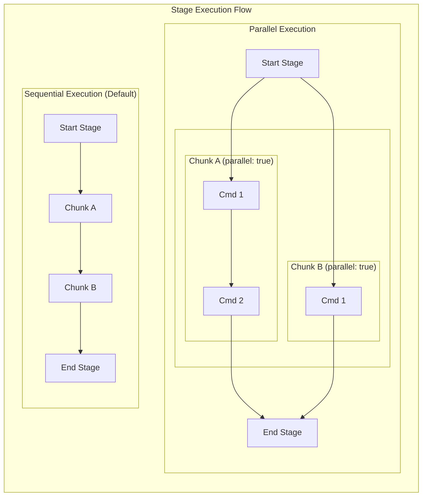

# Markdown Runner

Markdown Runner is a simple Go application designed to execute Markdown files as
pipelines.

One of the main use cases of the Markdown runner tool is to turn have your
documentation testable in a CI environment. This way, you can always detect if
your documentation is drifting away from the reality of your codebase.

## Usage

Installation on your system:

```bash
go install
```

Alternatively, you can run the tool directly with:

```bash
go run main.go --markdown-dir docs
```

List of the available options:

````bash {"stage":"help"}
markdown-runner --help
````
````shell markdown_runner
Usage of markdown-runner:
  -d	shorthand for -dry-run
  -dry-run
    	just list what would be executed without doing it
  -f string
    	shorthand for -file
  -file string
    	Run only a specific markdown file
  -i	shorthand for -interactive
  -ignore-breakpoints
    	ignore the breakpoints
  -interactive
    	prompt to press enter between each chunk
  -l	shorthand for -list
  -list
    	just list the files found
  -m string
    	shorthand for -markdown-dir (default "./docs")
  -markdown-dir string
    	where to find the markdown files to execute (default "./docs")
  -no-styling
    	disable spiners in cli
  -q	shorthand for -quiet
  -quiet
    	disable output
  -s string
    	shorthand for -start-from
  -start-from string
    	start from a specific stage name
  -t int
    	shorthand for -timeout (default 10)
  -timeout int
    	the timeout in minutes for every executed command (default 10)
  -u	shorthand for -update-files
  -update-files
    	update the chunk output section in the markdown files
  -v	shorthand for -verbose
  -verbose
    	print more logs
````

To execute this documentation, you can run the following command:

```bash
go run main.go -m . # add -u to update the documentation
```

> [!NOTE]
> To avoid infinite loops, the above chunk is not executable.

## Development setup

### Prerequisites

* Go 1.23 or later

### Testing

Unit tests can be run with:

```bash {"stage":"test", "rootdir":"$initial_dir"}
go test ./...
```
```shell markdown_runner
?   	github.com/markdown-runner	[no test files]
ok  	github.com/markdown-runner/chunk	(cached)
ok  	github.com/markdown-runner/config	(cached)
ok  	github.com/markdown-runner/parser	(cached)
ok  	github.com/markdown-runner/runner	(cached)
```

Integration tests can be run with:

```bash {"stage":"integration-test", "rootdir":"$initial_dir"}
./test/run.sh
```
```shell markdown_runner
--- Building markdown-runner binary ---
Running test #1: Happy path should succeed... ✅
Running test #2: Schema error should cause a failure... ✅
Running test #3: Failing command with a valid teardown... ✅
Running test #4: Parallel execution should result in interleaved output... ✅
Running test #5: Writer runtime should create a file with the correct content... ✅
Running test #6: Dry run should display DRY-RUN message and not execute... ✅
\n--- Test Summary ---
All 6 tests passed!
--- Cleaning up ---
Cleanup complete.
```

You can also run the integration tests with `-v` to show the details of every
tests

### Contributing

When contributing to this project, please make sure to update the documentation
as you add in new features or fix bugs.

Use the `-update-files` option when running the tool on this README.

## How to write an executable markdown file

### The terminology: Stages, chunks and commands

Executable markdown files work a bit like a CI workflow. The command is the
smallest element of them. It corresponds to an executable with its arguments to
be called onto the system. A chunk is a collection of commands and is used to
group them with an environment of execution, chunks can be executed in parallel
of each other within the same stage. And finally, there are the stages, which
are a collection of chunks. Stages gets executed one after the other.


#### Code chunks

In an executable markdown file chunk, every line gets executed. In order to be
What makes a chunk executable is a pice of json metadata that is attached to the
code fence of the chunk.

The code fence to create an executable chunk needs to have at least 3 back
quotes and a corresponding closing fence later on in the document.

For example:

````
``` something {"stage":"init"}
```
````

The only mandatory field being the stage name. The other possible fields are:

##### `"runtime":"bash"`

Specifies that the content of the chunk represents a bash script. By default the
script will be executed in a newly created temporary directory. (See
`"rootdir"` below), and we recommend leaving it this way unless you don't mind
leaving temporary files on your disk.

The script will be executed with the environment variables of the parent process
that started the markdown runner like any other commands of the pipeline.

Some changes are made to the script before it gets executed, it'll get:

* prefixed with `set -euo pipefail`, meaning that it will
  error at the first failing commands
* suffixed with `printenv` to extract all the environment variables the
  user added in.

We recommend leaving these options in place.

##### `"runtime":"writer"`

Writes the content of the chunk to disk. The metadata needs to contain
`"destination":"some_place"` to know where to write the content.

##### `"label":"some label"`

Gives a pretty printable name to a chunk. It's good for bash runtimes, as
the command to execute is always `./script.sh` so if you want to have a
differentiable name in the logs, use this field.

##### `"rootdir"

###### `"rootdir":"$initial_dir"`

The commands in the chunk will the executed from directory where the markdown
runner was started.

By default, the chunk will be executed in a unique temporary directory that is
created at runtime. The temporary directory is created under `/tmp`, and is
named with `$tmpdir.$uuid`. The temporary directory is deleted after the chunk
is executed.

###### `"rootdir":"$tmpdir.x"`

Create a new temporary directory to execute the chunk. If another chunk reuses
the same suffix (`.x` in the example) it'll share the same directory. Different
suffixes will result in different directories. Useful when you need to chain
chunks or to reuse some cached files between chunks

The following diagram shows how `rootdir` affects the execution environment:


##### `"parallel":true`

Makes the chunk executed in parallel of the other chunks within the same stage.



This works best if:

* there's only a single command in the chunk (or if the chunk is a bash chunk)
* if all the commands in the stage are made to run in parallel.

> [!NOTE]
> For non bash runtime:
> The parallel behavior has a simplistic implementation. Only the last
> command of the chunk is really started asynchronously. The other ones are
> sequentially executed before that. If you need more complex parallel behavior,
> consider using a bash runtime to program it the way you'd like it to be.

##### `"breakpoint":"true"`

Enters interactive mode when the chunk is started. Useful for debugging
purposes. Better to use alongside `--verbose`

##### `"id":"someID"`

Give an ID to a chunk so that it can get referenced later on

##### `"requires":"stageName/id"`

Makes the execution of the given stage dependant of the correct execution of the
pointed stage. To be used in teardown chunks.

This is particularly useful for running cleanup tasks only when their corresponding setup tasks have completed, as shown below:


### Updating the markdown file with the output of the chunks

When running the markdown runner tool, you can use the `--update-files` option to
make the tool insert the output of every chunk (if any) inside the source
markdown

The results of the execution will get stored in a new code fence right after
the chunk that was executed, `shell markdown_runner` set indicating to the
tool that this a disposable code fence that can be overridden in the future.

### Execution Environment of the chunks

Every chunk is started with the environment of the parent process that started
it. If as chunk whom runtime is bash is executed, all the variables it adds to
its own env via `export` will get added to the environment of subsequent
chunks.

The following diagram illustrates this flow:


The runner also injects a `WORKING_DIR` variable, which contains the path to the
directory where the `markdown-runner` was started.

### Examples

#### Creating and running our first executable markdown file

Let's create a markdown file containing an executable chunk, and save it as
`simple_tutorial.md`

````md {"stage":"test1", "runtime":"writer", "destination":"simple_tutorial.md", "rootdir":"$tmpdir.1"}
# Demo 1

This is a source markdown file it has a simple chunk that gets executed:

## the chunk
```bash {"stage":"inner_test1"}
echo this line will get printed in the output chunk below.
```
When this document is going to get executed, it'll have a new block above this
line containing the actual output of the executed chunk.
````

We will need to pass the folder containing this markdown file to the markdown
runner.

```bash {"stage":"test1", "rootdir":"$tmpdir.1", "runtime":"bash"}
export MARKDOWN_DIR=$(pwd)
```

Now run the script.

```bash {"stage":"test1", "runtime":"bash"}
cd ${WORKING_DIR}
go run main.go \
   --update-files \
   --quiet \
   --markdown-dir ${MARKDOWN_DIR}
```

As we've executed the markdown runner tool with the `--update-files` option.
It'll make the tool insert the output of every chunks (if any) inside the
source markdown file. Let's have a look at the updated markdown file:

````bash {"stage":"test1", "rootdir":"$tmpdir.1"}
cat simple_tutorial.md
````
````shell markdown_runner
# Demo 1

This is a source markdown file it has a simple chunk that gets executed:

## the chunk
```bash {"stage":"inner_test1"}
echo this line will get printed in the output chunk below.
```
```shell markdown_runner
this line will get printed in the output chunk below.
```
When this document is going to get executed, it'll have a new block above this
line containing the actual output of the executed chunk.
````

#### Sharing variables between chunks

Any export in a bash environment makes the content available for subsequent
chunks.

````markdown
```bash {"stage":"test2", "runtime":"bash"}
export SOME_VARIABLE=$(sleep .1s && echo "This is some content")
export TEST="some value"
```
````

The chunk below is able to perform some comparisons with value of
`SOME_VARIABLE`

````markdown
```bash {"stage":"test2", "runtime":"bash"}
if [ "$SOME_VARIABLE" == "This is some content" ]; then
  echo "same string"
fi
```
```shell markdown_runner
same string
```
````

#### Executing in parallel

Parallelism can be important for some workflows, when for instance two processes
need to chat with each other.

To demonstrate the capability, we're executing two pairs of chunks.
The first pair runs in parallel, and does concurrent writing to a file on disk.
The second pair acts as the control group and performs the writing sequentially,
one after the other.

On a parallel execution, we expect the content of file to contain interleaved
content from the two chunks, whereas on the sequential execution, we expect
the content of the file to be written in a single block, without interleaving.

##### The first pair is writing to `output` in parallel

````markdown
```bash {"stage":"test3", "runtime":"bash", "parallel":true, "rootdir":"$tmpdir.2"}
for i in $(seq 1 10);
do
    echo FIRST$i >> output
    sleep .1
done
```
````

````markdown
```bash {"stage":"test3", "runtime":"bash", "parallel":true, "rootdir":"$tmpdir.2"}
for i in $(seq 1 10);
do
    sleep .1
    echo SECOND$i >> output
done
```
````

##### The second pair is writing to `output2` sequentially this time

````markdown
```bash {"stage":"test4", "runtime":"bash", "rootdir":"$tmpdir.2"}
for i in $(seq 1 10);
do
    echo FIRST$i >> output2
done
```
````

````markdown
```bash {"stage":"test4", "runtime":"bash", "rootdir":"$tmpdir.2"}
for i in $(seq 1 10);
do
    echo SECOND$i >> output2
done
```
````

##### Then let's compare the two files and asses that the two files are different

````markdown
```{"stage":"test4", "rootdir":"$tmpdir.2", "runtime":"bash"}
DIFF=$(diff output output2 || echo "")
if [[ -z ${DIFF} ]]; then
    echo "the files are the same, that's a problem."
    exit 1
else
    echo "the two files are different, we're running in parallel"
fi
```
```shell markdown_runner
the two files are different, we're running in parallel
```
````

#### Teardown & dependencies

Teardown chunks are executed even if something went wrong in the middle of the
execution.

Adding a dependency to the teardown chunk makes it execute only if its dependant
chunk did execute correctly. That allows to make sure that a teardown stage only
tears down things that have been built before.

````markdown {"stage":"test5", "runtime":"writer", "destination":"simple_tutorial.md", "rootdir":"$tmpdir.3"}
# Demo teardown

## Two classical chunks

```bash {"stage":"inner_test1", "id":"someID", "label":"working command"}
echo this executes correctly
```

```bash {"stage":"inner_test1", "id":"someID2", "runtime":"bash", "label":"failing command"}
echo this has failed
exit 1
```

## Two teardown chunks

This one has an output, because it's dependency did run correctly

```bash {"stage":"teardown", "requires":"inner_test1/someID"}
echo executed because inner_test1/someID got executed
```

This one won't

```bash {"stage":"teardown", "requires":"inner_test1/someID2"}
echo not executed because someID2 is missing in inner_test1
```
````
```bash {"stage":"test5", "rootdir":"$tmpdir.3", "runtime":"bash"}
export MD_DIR=$(pwd)
```

Let's run and see the result

```bash {"stage":"test5", "runtime":"bash"}
cd ${WORKING_DIR}
go run main.go \
   --no-styling \
   --markdown-dir ${MD_DIR} | grep "SUCCESS.*someID" || exit 0
```
```shell markdown_runner



working command

SUCCESS: working command

failing command


failing command


ERROR: stdout:
this has failed

stderr:

exit code:1
echo executed because inner_test1/someID got executed

echo executed because inner_test1/someID got executed

echo executed because inner_test1/someID got executed


SUCCESS: echo executed because inner_test1/someID got executedexit status 1
```

As we can see only the first teardown command did run.
