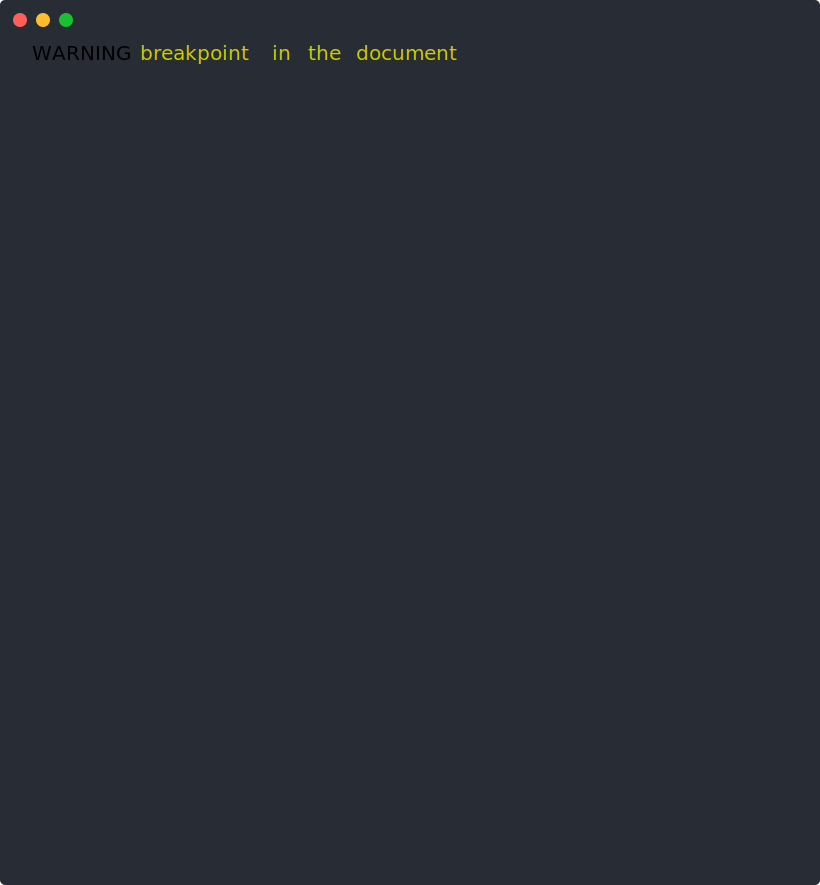
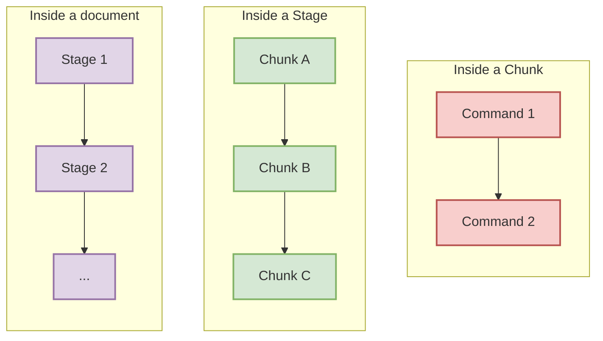
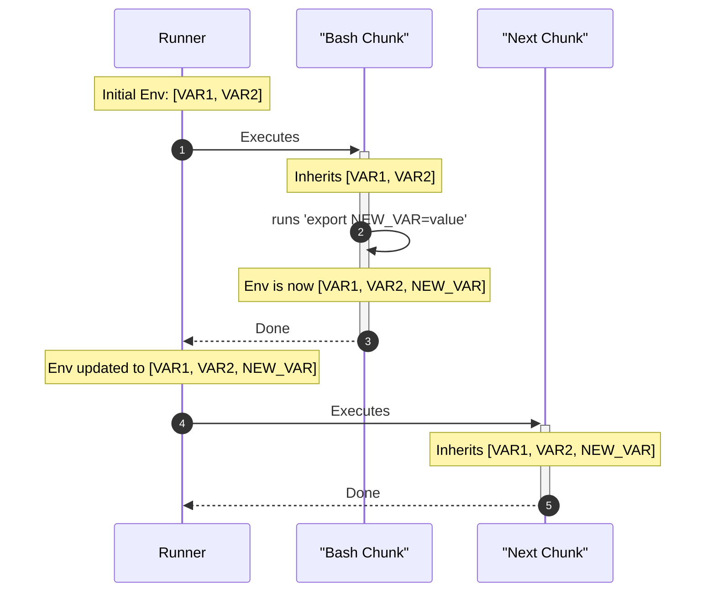
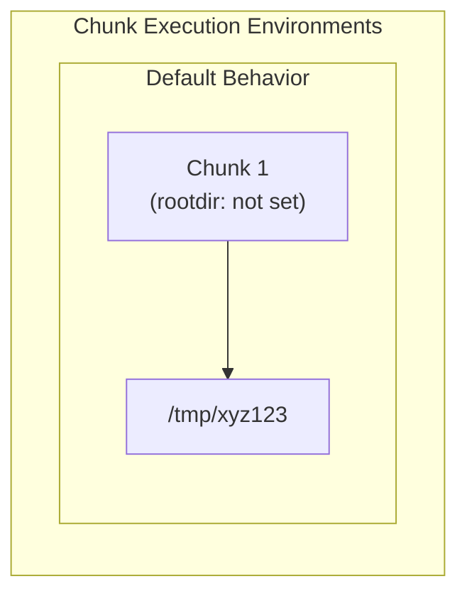
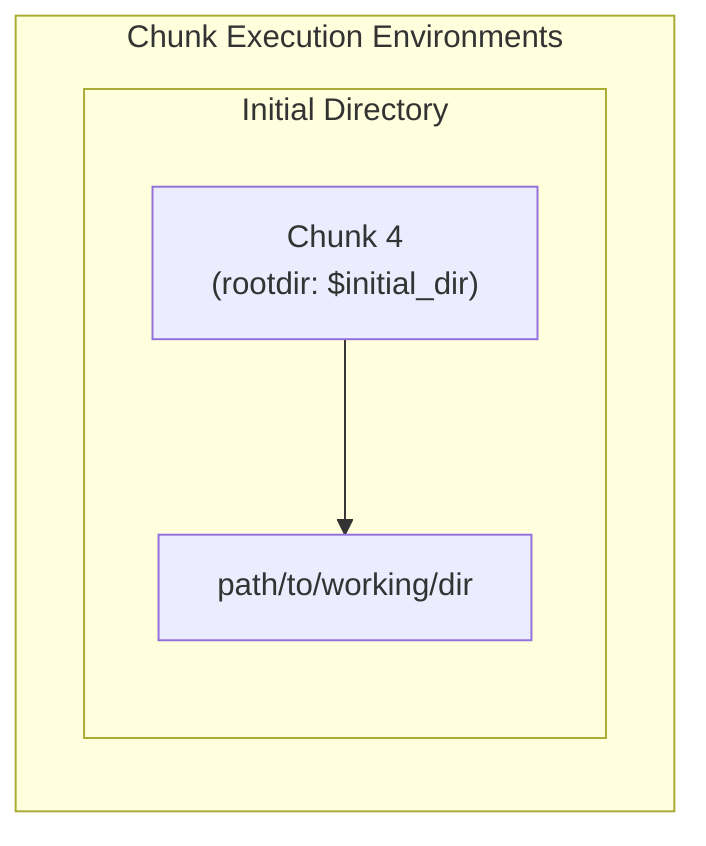
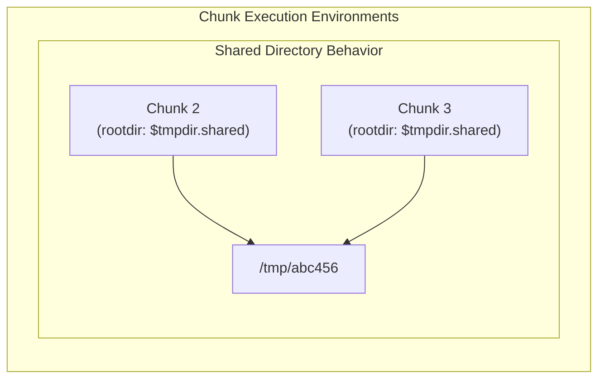
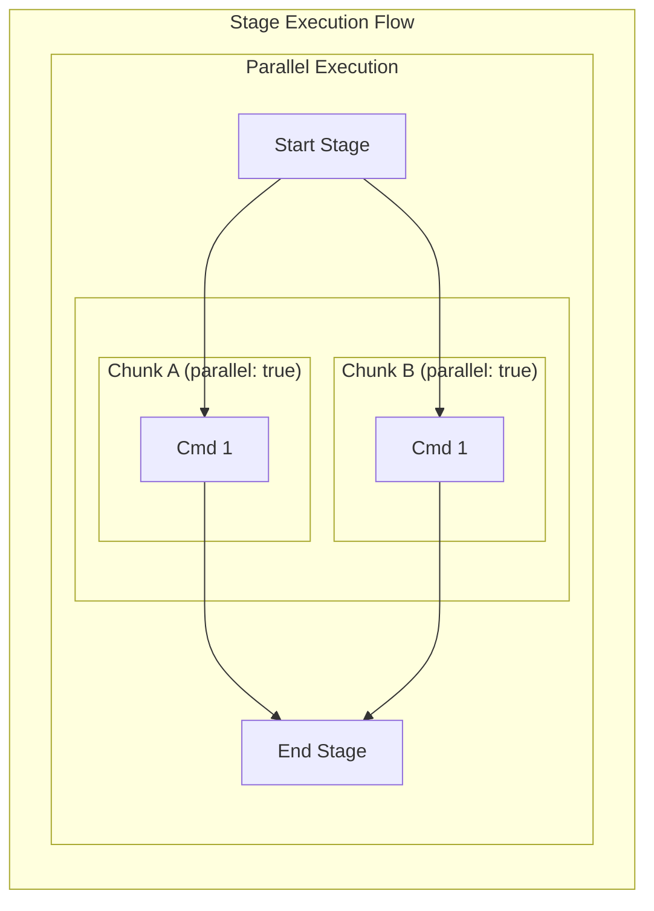
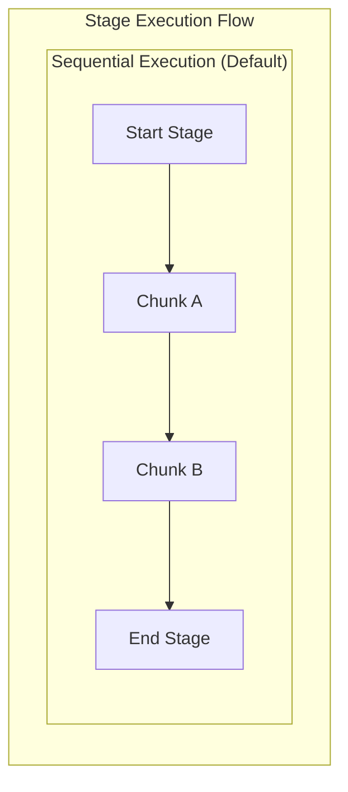

## Markdown-runner in a nutshell

### what

Executes markdown files like they were ci pipelines

### Why

Makes documentation testable, avoid having it to drift away from the evolving
code

### How

By placing special metadata on the chunks inside the markdown files

---

## Installation

```{.bash}
go install -x github.com/arkmq-org/markdown-runner@latest
```

---

## Usage

<div style="width: 50%;float:left;">
```{.bash}
markdown-runner README.md
```

](demo.svg)

</div>
<div style="float: right; width: 50%;">
```{.bash}
markdown-runner README.md
```



</div>
<div style="clear: both;"></div>

---
---

## Key concepts



- **Stage**: A set of chunks grouped together
- **Chunk**: A markdown code fence with special metadata
- **Command**: Some command to execute on the machine

---

## How to define a chunk

### Mandatory field

- stage: name, (teardown is a special one)

### Optional fields

- runtime
- rootdir
- Control flow: id, requires, parallel
- User interactions: breakpoint, label

### Example

<div style="width:25%;margin-left:36%">

````{.markdown .number-lines}
```bash {"stage":"build"}
echo "Hello, World!"
```
````

</div>

---

### Runtime

#### Default

````{.markdown .number-lines}
```md {"stage":"test"}
echo this is a command
echo can't interpret $VAR1, it's not bash!
```
````

#### Bash

````{.markdown .number-lines}
```md {"stage":"test", "runtime":"bash"}
echo hello from bash, I can read $VAR1
```
````

#### Writer

````{.markdown .number-lines}
```md {"stage":"write_file", "runtime":"writer", "destination":"hello.txt", "rootdir":"$tmpdir.writer"}
Hello from the writer!
This is a test.
```
````

````{.markdown .number-lines}
```bash {"stage":"verify_file", "runtime":"bash", "rootdir":"$tmpdir.writer"}
if grep -q "Hello from the writer!" hello.txt; then
  echo "File content is correct."
else
  echo "File content is incorrect."
  exit 1
fi
```
````

---

### Runtime/Bash

#### exporting new environment variables

<div style="float: left; width:77%; margin-left:-20%;">



</div>
<div style="float: right; width: 43%;">

````{.markdown .number-lines}
```bash {"stage":"test", "runtime":"bash"}
export NEW_VAR=$VAR1+$VAR2
```
````

````{.markdown .number-lines}
```bash {"stage":"test", "runtime":"bash"}
echo NEW_VAR=$NEW_VAR
```
````

</div>
<div style="clear: both;"></div>

---

### root directory

#### default

<div style="width: 55%;float:left;">



</div>
<div style="float: right; width: 43%;">

````{.markdown .number-lines}
```md {"stage":"init"}
pwd
```
````
</div>
<div style="clear: both;"></div>

---

### root directory

#### $initial_dir

<div style="width: 55%;float:left;">



</div>
<div style="float: right; width: 43%;">

````{.markdown .number-lines}
```md {"stage":"init", "rootdir":"$initial_dir"}
pwd
```
````

</div>
<div style="clear: both;"></div>

---

### root directory

#### Shared



````{.markdown .number-lines}
```md {"stage":"write_file", "rootdir":"$tmp.shared"}
echo pwd > file_1
```
````

````{.markdown .number-lines}
```bash {"stage":"verify_file", "rootdir":"$tmpdir.shared"}
[[ "$(pwd)" == "$(file_1)" ]] && echo "✅ Paths match." || echo "❌ Paths do not match."
```
````

---

### Control flow

#### Parallel execution

<div style="float: left; width: 55%;">



</div>
<div style="float: right; width: 43%;">

````{.markdown .number-lines}
```bash {"stage":"write", "runtime":"bash", "parallel":true, "rootdir":"$tmpdir.parallel"}
for i in $(seq 1 5); do
  echo "A$i" >> output
  sleep .01
done
```
````

````{.markdown .number-lines}
```bash {"stage":"write", "runtime":"bash", "parallel":true, "rootdir":"$tmpdir.parallel"}
for i in $(seq 1 5); do
  echo "B$i" >> output
  sleep .01
done
```
````


</div>
<div style="clear: both;"></div>

```
B1
A1
B2
B3
B4
A2
A3
A4
B5
A5
```

---

### Control flow

#### Sequential execution

<div style="float: left; width: 55%;">



</div>
<div style="float: right; width: 43%;">

````{.markdown .number-lines}
```bash {"stage":"write", "runtime":"bash", "rootdir":"$tmpdir.sequential"}
for i in $(seq 1 5); do
  echo "A$i" >> output
  sleep .01
done
```
````

````{.markdown .number-lines}
```bash {"stage":"write", "runtime":"bash", "rootdir":"$tmpdir.sequential"}
for i in $(seq 1 5); do
  echo "B$i" >> output
  sleep .01
done
```
````
```
A1
A2
A3
A4
A5
B1
B2
B3
B4
B5
```

---

### Control flow

#### Requires, and teardown

<div style="float: left; width: 75%;margin-left:-25%">

```Mermaid
graph TD
    subgraph "Stage: main"
      direction LR
      ChunkSuccess("Chunk 'setup' (succeeds)")
      ChunkFail("Chunk 'main-work' (fails)")
    end

    subgraph "Stage: teardown"
      direction LR
      TeardownSuccess("Teardown for 'setup'<br/>requires: main/setup")
      TeardownFail("Teardown for 'main-work'<br/>requires: main/main-work")
    end

    ChunkSuccess -- "dependency met" --> TeardownSuccess
    TeardownSuccess --> TeardownSuccessRun["Result: Executed"]

    ChunkFail -- "dependency NOT met" --> TeardownFail
    TeardownFail --> TeardownFailSkip["Result: Skipped"]
```

</div>
<div style="float: right; width: 43%;">

````{.markdown .number-lines}
```bash {"stage":"main", "id":"setup", "runtime":"bash"}
exit 0
```
````

````{.markdown .number-lines}
```bash {"stage":"main", "id":"main-work", "runtime":"bash"}
exit 1
```
````

````{.markdown .number-lines}
```bash {"stage":"teardown", "requires":"main/main-work"}
echo "teardown does not execute"
```
````

````{.markdown .number-lines}
```bash {"stage":"teardown", "requires":"main/setup"}
echo teardown should execute
```
````
</div>
<div style="clear: both;"></div>

---

## Known usages

- **ActiveMQ Artemis Operator CI**: The operator runs Markdown Runner as part of its CI ([workflow lines 98–107](https://github.com/arkmq-org/activemq-artemis-operator/blob/9eed53d41e619a41a8f0dc1ae01e52ad698f2adb/.github/workflows/ci.yml#L98-L107)).
- **Operator tutorials tested**:
  - [Send/receive via ingress](https://github.com/arkmq-org/activemq-artemis-operator/blob/main/docs/tutorials/send_receive_ingress.md)
  - [Send/receive via ingress (PEM)](https://github.com/arkmq-org/activemq-artemis-operator/blob/main/docs/tutorials/send_receive_ingress_pem.md)
  - [Send/receive via port-forwarding](https://github.com/arkmq-org/activemq-artemis-operator/blob/main/docs/tutorials/send_receive_port_forwarding.md)


## Q&A
